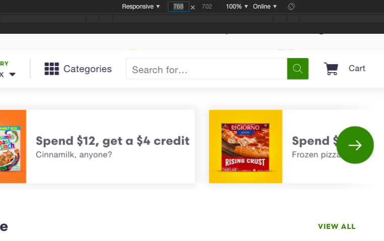

# ShiptChallenge

## ***1) Login page***
 Description: A registered user be able to successfuly log into their shipt account.
 Pre-Condition: User must be a registered member with a valid username and password.
 Assumption: User is using a supported browser.
### Test steps: 
            1) Navigate to shop.shipt.com/login.
            2) In the "EMAIL" field, enter the email of the registered user.
            3) In the "PASSWORD" field, enter the password of the registered user.
            4) Click the "LOG IN" button.
Expected result: network log returns status as 200 and user's home page is displayed. 

## ***2) Why You Buggin***
A/B. When user logs into shop.shipt.com there is an arrow element on the right side of the display.

When the window width is reduced below 768 pixels, the arrow dissapear.

 C. If this is bug goes unfixed then users will not be able to scroll through the horizontal product lists. The arrow should be avaliable as long as the user is on a non-mobile browser.
 D. To report this issue I would provide screen shots and a description on how to replicate the bug.
 E. I would rate this bug a 4, because it does inhibit full user functionality, however it is not likely to be replicated by users.

## ***3)Still Buggin***
One of the possible reasons for the phone number not updating is the correct api endpoint is not being reached. If a different endpoint is being reached it may appear that the number is being saved, but the value is never accessed so it's never changed. Another explanation could be poor design. If that field of information has an api limit of 2 requests, then the third request should return an error message explaining that the ammount of times it can be changed in a given period has been reached. If not message or error appears, then the user would assume it's been changed to the third number.

## ***4) SQL Statements***
    1) SELECT * FROM interview.stores WHERE allowed_alcohol is True;

    2) SELECT name, price,store_id FROM products LEFT JOIN store_prices ON products.id = store_prices.product_id WHERE store_prices.store_id = 1 ORDER BY price DESC;

    3) SELECT * FROM products LEFT JOIN order_lines ON products.id = order_lines.store_id WHERE order_lines.store_id != 2;

    4) SELECT name, qty FROM products LEFT JOIN order_lines ON products.id = order_lines.product_id;

## ***shipt_login_automation.py***

### This simple script was written using Selenium to perform the task of logging into your Shipt account!

### Requirments for running this script

1) First, you will need GoogleChrome! Visit https://www.google.com/chrome/ to install Google Chrome.

2) Second, you will need Python3! Visit https://www.python.org/downloads/ to install the 3.7.3 version of Python.

3) Third, you will need Selenium and ChromeDriver (The ChromeDriver version must be specific to your current google chrome browser version). Visit https://pypi.org/project/selenium/ for links to both Selenium and Chrome Driver

4) You will need to have this repository, or the file named "shipt_login_automation.py" on your machine.

### Now that the requirments have been met, let's run our program!

1) Navigate to the location of the folder "ShiptChallenge"(if you saved the entire repository) or, the file titled "shipt_login_automation.py". If you decided to only download the file, I'd reccomend placing it somewhere easily accessible.

2) Now that you've found the folder, open the terminal at that location. This can be done by right-clicking and finding "Open in terminal"(if you're on Windows), or two-finger clicking and finding "New terminal on folder"(if you're on MAC).
     
3) Lastly type "Python3 shipt_login_automation.py" into your terminal, and press enter to run the program!

## ***Swapi Automated Tests***
### Requirments for running the tests
1) First, you will need Python3! Visit https://www.python.org/downloads/ to download the latest version of Python. These tests were written using Python 3.7.3!

2) Second, you will need PyTest! Visit https://docs.pytest.org/en/latest/getting-started.html for information on how to install PyTest. These tests were written using PyTest 5.2.1!

3) You will need to have this repository, or the file named "swapi_tests.py" on your machine.
### How to run the tests

1) Navigate to the location of the folder "ShiptChallenge"(if you saved the entire repository) or, the file titled "swapi_tests.py". If you decided to only download the file, I'd reccomend placing it somewhere easily accessible.

2) Now that you've found the folder, open the terminal at that location. This can be done by right-clicking and finding "Open in terminal"(if you're on Windows), or two-finger clicking and finding "New terminal on folder"(if you're on MAC).

3) Lastly type "pytest swapi_tests.py" into your terminal, and press enter to run the program!

## ***Follow-up questions***

1) All tools and languages used were recommended.

2) In locating the elements for the UI test I navigated to "shipt.com/login", and inspected the page. Upon inspection Google chrom will find the code related to an element that is being hovered over.

3) The most common causes of instability in UI automation is miscommunication, knowing whether to automate or manually test, and inadequate test building/maintenance. Not clearly communicating the expectations of a project can lead to many different issues such as testing arbitrary testing. However The most detrimental issue is wasted time. This ties into knowing when to automate, Not every test case needs to be automated. If you can properly identify the siigns of a test needing automatinon, then you will save time for yourself and your team. Lastly not maintaining your test suite can lead to the code degrading. This can make it more difficult to change,harder to interpret, or produce inaccurate results.

4) To keep your tests consistent and easy to debug, you need to keep them simple, readable, and reliable. First keeping the tests simple can be done by testing one aspect of the application at a time. This will save time in understanding what aspects are passing and failing at run time. Second keeping tests readable can be done by having a descriptive name, and a clear scenario being tested. Lastly for a test to be reliable it should be replicaple and independent from external factors like the environment or the running order.

    
