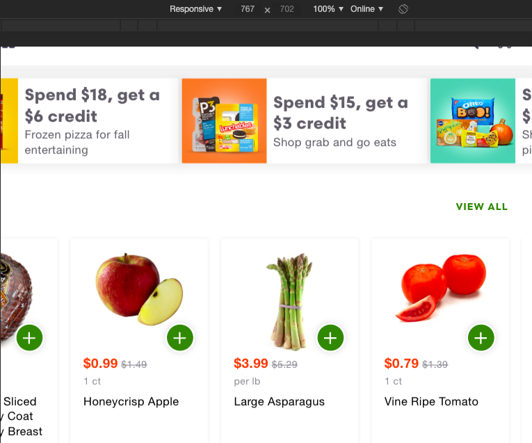

# ShiptChallenge

## ***1) Login page***
### Description: A registered user be able to successfuly log into their shipt account.
### Pre-Condition: User must be a registered member with a valid username and password.
### Assumption: User is using a supported browser.
### Test steps: 
            1) Navigate to shop.shipt.com/login.
            2) In the "EMAIL" field, enter the email of the registered user.
            3) In the "PASSWORD" field, enter the password of the registered user.
            4) Click the "LOG IN" button.
Expected result: network log returns status as 200 and user's home page is displayed. 

## ***2) Why You Buggin***
### A/B. When user logs into shop.shipt.com there is an arrow element on the right side of the display.

### When the window width is reduced below 768 pixels, the arrow dissapear.

### C. If this is bug goes unfixed then users will not be able to scroll through the horizontal product lists. The arrow should be avaliable as long as the user is on a non-mobile browser.
### D. To report this issue I would provide screen shots and a description on how to replicate the bug.
### E. I would rate this bug a 4, because it does inhibit full user functionality, however it is not likely to be replicated by users.

## ***3)Still Buggin***
### One of the possible reasons for the phone number not updating is the correct api endpoint is not being reached If a different endpoint is being reached it may appear that the number is being saved,but the value is never accessed so it's never changed. Another explanation could be poor design.If that field of information has an api limit of 2 requests,then the third request should return an error or message explaining that the amount of times it can be changedin agiven period has been reached. If no message or error  appears,then the user would assume it's been changed to the third number.

## ***4)SQL Statements***
    1) SELECT * FROM interview.stores WHERE allowed_alcohol is True;

    2) SELECT name, price,store_id FROM products LEFT JOIN store_prices ON products.id = store_prices.product_id WHERE store_prices.store_id = 1 ORDER BY price DESC;

    3)SELECT * FROM products LEFT JOIN order_lines ON products.id = order_lines.store_id WHERE order_lines.store_id != 2;

    4) SELECT name, qty FROM products LEFT JOIN order_lines ON products.id = order_lines.product_id;
    
    5) **ADD THIS ANSWER IN**